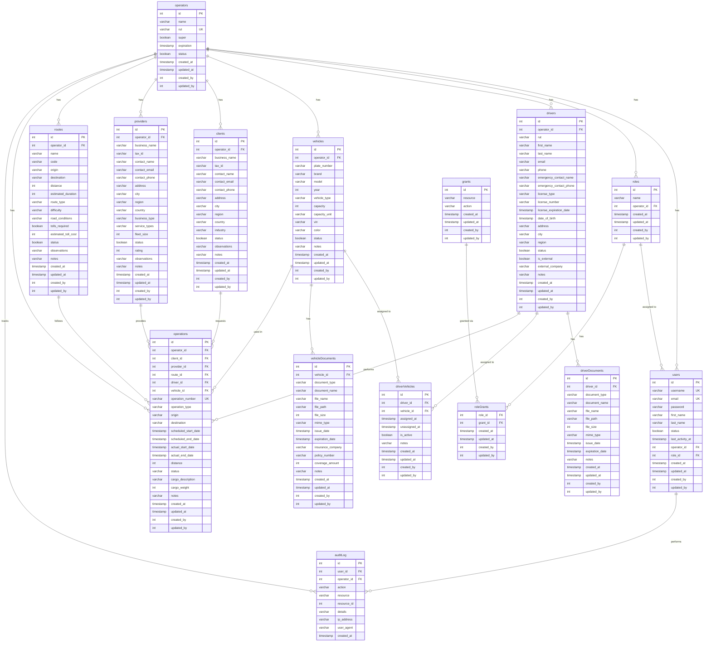

# Database Entity-Relationship Diagram

## Schema Overview

This database schema is designed for a **multi-tenant logistics and transport management system**. The key components are:

### Core Entities

1. **Operators** - The top-level tenant/organization entity
2. **Users** - System users with role-based access control
3. **Roles & Grants** - RBAC system for permissions management

### Operational Entities

4. **Drivers** - Driver management with licensing and documentation
5. **Vehicles** - Fleet management with documentation
6. **Clients** - Customer/client management
7. **Providers** - External transport provider management
8. **Routes** - Route/segment definitions
9. **Operations** - Core business operations/trips

### Supporting Entities

10. **Driver Documents** - Driver-related documentation storage
11. **Vehicle Documents** - Vehicle-related documentation storage
12. **Driver-Vehicle Assignments** - Many-to-many relationship tracking
13. **Audit Log** - System activity tracking

### Key Features

- **Multi-tenancy**: All entities are scoped to an `operator_id`
- **RBAC**: Role-based access control with granular permissions via grants
- **Document Management**: Comprehensive document tracking for drivers and vehicles
- **Audit Trail**: Complete activity logging for compliance
- **Fleet Management**: Driver-vehicle assignment tracking with history
- **Operations Tracking**: End-to-end trip/operation management

### Relationships

- Each **Operator** can have multiple users, drivers, vehicles, clients, providers, routes, and operations
- **Users** are assigned to a single role within their operator
- **Roles** have multiple grants (permissions) through a junction table
- **Drivers** and **Vehicles** can be assigned to each other (many-to-many)
- **Operations** connect drivers, vehicles, clients, providers, and routes
